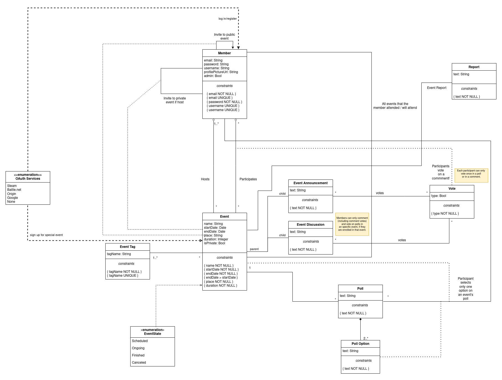

# EBD: Database Specification Component

Providing the end-user with a **simple**, **quick** and **effective** way to host and control their events, along with allowing participants to easily find information about every aspect of the events they're enrolled in, or simply interested in possibly participating, **is our main goal**.

## A4: Conceptual Data Model

With this artifact, we seek to outline the structure and organization of the data to be held within the Event Pointer Project's database.

### 1. Class diagram

The following diagram (Figure 1) presents the UML with all entities as well as the relationships (including multiplicity) between them, attributes and its constraints for the Event Pointer system. 



<small><b> Figure 1: Event Pointer's UML Diagram.</b></small>

### 2. Additional Business Rules
 - Members can only comment (including comment votes) and vote on polls in a specific event, if they are enrolled in that event.
 - Each participant can only vote once in a poll or in a comment.


## A5: Relational Schema, validation and schema refinement

This artifact contains the Relational Schema obtained after the conversion of the previous Conceptual Data Model. The Relational Schema includes, for each relation, its own attributes, domains, primary keys, foreign keys and constraints.

### 1. Relational Schema

The following schema includes, for each relation, attributes, domains, primary keys, foreign keys and constraints. 


| Relation reference | Relation Compact Notation |
|--------------------|---------------------------|
| R01 | member (**idMember**,username NN UK, email NN UK, password NN, profilePictureURL, isAdmin NN) |
| R02 | event (**idEvent**, name NN, startDate NN, endDate NN, place NN, duration, state NN CK state IN event_state, isPrivate NN, tag -> event_tag) |
| R03 | event_role(**idRole**.idMember -> member, idEvent -> event, isHost)
| R04 | event_tag (**idTag**, tagName NN UK) |
| R05 | event_announcement (**idMessage**, text NN ,idRole->event_role) |
| R06 | event_comment (**idComment**, text NN, idRole->event_role) |
| R07 | event_poll (**idPoll**, text NN, idRole->event_role) |
| R08 | poll_option (**idOption**, idPoll->poll, text NN) |
| R09 | vote (**idVote**, type NN, idParticipant->EventRole, idComment->event_comment, idAnnouncement->event_announcement) CK  ((idAnnouncement IS NOT NULL AND idComment IS NULL) OR (idAnnouncement IS NULL AND idComment IS NOT NULL))|
| R10 | report (**idReport**, idEvent -> event)

Legend:
- UNIQUE KEY = UK
- NOT NULL = NN
- CK = CHECK

### 2. Domains

The specification of additional domains can also be made in a compact form, using the notation:
| Domain Name | Domain Specification |
|-------------|----------------------|
| Today | DATE DEFAULT CURRENT_DATE |
| EventState | ENUM ('Scheduled', 'Ongoing', 'Finished', 'Canceled') |

### 3. Schema validation

In order to validate the previous Relational Schema, all functional dependencies are identified as well as the normalization of all relation schemas. 

| **TABLE R01** | (member) |
|---------------|------|
| **Keys** | { idMember }, { username }, { email } |
| **Functional Dependencies:** |  |
| FD0101 | idMember → {username, email, password, profilePictureURL, isAdmin} |
| FD0102 | email → {idMember, username, password, profilePictureURL, isAdmin} |
| FD0103 | username → {idMember, email, password, profilePictureURL, isAdmin} |
| **Normal Form** | BCNF |

| **TABLE R02** | (eventG) |
|---------------|------|
| **Keys** | { idEvent } |
| **Functional Dependencies:** |  |
| FD0201 | idEvent → {name, startDate, endDate, place, duration, eventState, isPrivate, tag} |
| **Normal Form** | BCNF |

| **TABLE R03** | (event_role) |
|---------------|------|
| **Keys** | { idRole } |
| **Functional Dependencies:** |  |
| FD301 | idRole → {idMember,idEvent,isHost} |
| **Normal Form** | BCNF |

| **TABLE R04** | (event_tag) |
|---------------|------|
| **Keys** | { idTag }, { tagName } |
| **Functional Dependencies:** |  |
| FD0401 | idTag → {tagName} |
| FD0402 | tagName → {idTag} |
| **Normal Form** | BCNF |

| **TABLE R05** | (event_announcement |
|---------------|------|
| **Keys** | { idMessage } |
| **Functional Dependencies:** |  |
| FD0501 | idMessage → {text, idRole} |
| **Normal Form** | BCNF |

| **TABLE R06** | (event_comment) |
|---------------|------|
| **Keys** | { idComment } |
| **Functional Dependencies:** |  |
| FD0601 | idComment → {text, idRole} |
| **Normal Form** | BCNF |

| **TABLE R07** | (event_poll) |
|---------------|------|
| **Keys** | { idPoll } |
| **Functional Dependencies:** |  |
| FD0701 | idPoll → {text, idRole} |
| **Normal Form** | BCNF |

| **TABLE R08** | (poll_option) |
|---------------|------|
| **Keys** | { idOption } |
| **Functional Dependencies:** |  |
| FD0801 | idPoll → {text, idEvent} |
| **Normal Form** | BCNF |

| **TABLE R09** | (vote) |
|---------------|------|
| **Keys** | { idVote } |
| **Functional Dependencies:** |  |
| FD0901 | idVote → {type, idParticipant, idComment, idAnnouncement} |
| **Normal Form** | BCNF |

| **TABLE R010** | (report) |
|---------------|------|
| **Keys** | { idReport } |
| **Functional Dependencies:** |  |
| FD1001 | idReport → {idEvent} |
| **Normal Form** | BCNF |

| **TABLE R011** | (invite) |
|---------------|------|
| **Keys** | { idInvite } |
| **Functional Dependencies:** |  |
| FD1001 | idInvite → {participant, host, eventId} |
| **Normal Form** | BCNF |

| **TABLE R012** | (ask_access) |
|---------------|------|
| **Keys** | { idAskAccess } |
| **Functional Dependencies:** |  |
| FD1001 | idAskAccess → {participant, eventId} |
| **Normal Form** | BCNF |


## A6: Indexes, triggers, transactions and database population

This artefact contains the database's workload with a study of the predicted system load (database load) as wells as the physical schema of the Event Pointer database, the identification and characterisation of the indexes, triggers, for data integrity rules support, and the definition of the database user-defined functions. 

This artefact also presents the transactions needed to assure the data integrity in the presence of concurrent accesses, with their own isolation level which is explicitly stated and justified. Finally a complete database creation script, including all SQL necessary to define all integrity constraints, indexes and triggers and includes a separate script with INSERT statements to populate the database. 


### 1. Database Workload

| **Relation reference** | **Relation Name** | **Order of magnitude** | **Estimated growth** |
|------------------------|-------------------|------------------------|----------------------|
| R01 | member | 10 k  | 10 / day |
| R02 | event | 100 | 1 / day |
| R03 | event_role | 1 k  | 10 / day |
| R04 | event_tag | 10 | none |
| R05 | event_announcement | 100 | 1 / day |
| R06 | event_comment | 1 k | 10 / day |
| R07 | event_poll | 1 k | 10 / day |
| R08 | poll_option | 100 | 1 / day |
| R09 | vote | 1 k | 10 / day |
| R10 | report | 100 | 1 / day |

### 2. Proposed Indices

#### 2.1. Performance Indices

| **Index** | IDX01 |
|-----------|-------|
| **Relation** | event |
| **Attribute** | state |
| **Type** | Hash |
| **Cardinality** | low |
| **Clustering** | No |
| **Justification** | Table ‘event’ is frequently accessed to obtain event's information. After analysing possible indexes 'state' was the most interesting since obtaining all events in a specific state is a frequent request . |
| `SQL code` | CREATE INDEX event_state ON event USING hash (state); |

| **Index** | IDX02 |
|-----------|-------|
| **Relation** | event |
| **Attribute** | enddate |
| **Type** | B-tree |
| **Cardinality** | low |
| **Clustering** | No |
| **Justification** | Table ‘event’ is frequently accessed to filter the events by date. A b-tree index will provide faster date range queries based on the event's end date. |
| `SQL code` | CREATE INDEX end_event ON event USING btree (enddate); |

| **Index** | IDX03 |
|-----------|-------|
| **Relation** | event |
| **Attribute** | startdate |
| **Type** | B-tree |
| **Cardinality** | low |
| **Clustering** | No |
| **Justification** | Table ‘event’ is frequently accessed to filter the events by date. A b-tree index will provide faster date range queries based on the event's start date. |
| `SQL code` | CREATE INDEX start_event ON event USING btree (startdate); |

#### 2.2. Full-text Search Indices

The system being developed must provide full-text search features supported by PostgreSQL. Thus, it is necessary to specify the fields where full-text search will be available and the associated setup, namely all necessary configurations, indexes definitions and other relevant details.
| **Index** | IDX11 |
|-----------|-------|
| **Relation** | event |
| **Attribute** | name |
| **Type** | GIN |
| **Clustering** | No |
| **Justification** | To provide full-text search features to look for events based on matching names. The index type is GIN because the indexed fields are not expected to change often. |
| `SQL code` | -- Add column to event to store computed ts_vectors.
ALTER TABLE event
ADD COLUMN tsvectors TSVECTOR;

-- Create a function to automatically update ts_vectors.
CREATE FUNCTION event_search_update() RETURNS TRIGGER AS $$
BEGIN
 IF TG_OP = 'INSERT' THEN
        NEW.tsvectors = (
         setweight(to_tsvector('english', NEW.name), 'A')
        );
 END IF;
 IF TG_OP = 'UPDATE' THEN
         IF (NEW.name <> OLD.name) THEN
           NEW.tsvectors = (
             setweight(to_tsvector('english', NEW.name), 'A')
           );
         END IF;
 END IF;
 RETURN NEW;
END $$
LANGUAGE plpgsql;

-- Create a trigger before insert or update on event.
CREATE TRIGGER event_search_update
 BEFORE INSERT OR UPDATE ON event
 FOR EACH ROW
 EXECUTE PROCEDURE event_search_update();


-- Finally, create a GIN index for ts_vectors.
CREATE INDEX search_idx ON event USING GIN (tsvectors);  |

### 3. Triggers

User-defined functions and trigger procedures that add control structures to the SQL language or perform complex computations, are identified and described to be trusted by the database server. Every kind of function (SQL functions, Stored procedures, Trigger procedures) can take base types, composite types, or combinations of these as arguments (parameters). In addition, every kind of function can return a base type or a composite type. Functions can also be defined to return sets of base or composite values.

| **Trigger** | TRIGGER01 |
|-------------|-----------|
| **Description** | A member can only comment in an event poll, if he is enrolled in that specific event |
| `SQL code` | CREATE FUNCTION comment_in_event_poll() RETURNS TRIGGER AS
   $BODY$
   BEGIN
        IF EXISTS (SELECT * FROM eventG INNER JOIN event_role ON eventG.id = event_role.eventId INNER JOIN member ON event_role.memberId = member.id WHERE NEW.eventG.id = event_role.eventId AND NEW.member.id = event_role.memberId) THEN
           RAISE EXCEPTION 'A member can only comment in an event poll, if he is enrolled in that specific event.';
        END IF;
        RETURN NEW;
   END
   $BODY$
   LANGUAGE plpgsql;

   DROP TRIGGER IF EXISTS comment_in_event_poll ON event_comment CASCADE;
   CREATE TRIGGER delete_comment_in_event_poll
        BEFORE INSERT OR UPDATE ON event_comment
        FOR EACH ROW
        EXECUTE PROCEDURE comment_in_event_poll(); |

| **Trigger** | TRIGGER02 |
|-------------|-----------|
| **Description** | A member can only delete a comment in an event poll, if he is enrolled in that specific event |
| `SQL code` | CREATE FUNCTION delete_comment_in_event_poll() RETURNS TRIGGER AS
   $BODY$
   BEGIN
        IF EXISTS (SELECT * FROM eventG INNER JOIN event_role ON eventG.id = event_role.eventId INNER JOIN member ON event_role.memberId = member.id WHERE NEW.eventG.id = event_role.eventId AND NEW.member.id = event_role.memberId) THEN
           RAISE EXCEPTION 'A member can only delete a comment in an event poll, if he is enrolled in that specific event and the comment belongs to him.';
        END IF;
        RETURN NEW;
   END
   $BODY$
   LANGUAGE plpgsql;

   DROP TRIGGER IF EXISTS delete_comment_in_event_poll ON event_comment CASCADE;
   CREATE TRIGGER delete_comment_in_event_poll
        BEFORE DELETE ON event_comment
        FOR EACH ROW
        EXECUTE PROCEDURE delete_comment_in_event_poll(); |

| **Trigger** | TRIGGER03 |
|-------------|-----------|
| **Description** | A member can only vote in an event poll, if he is enrolled in that specific event |
| `SQL code` | CREATE FUNCTION vote_in_event_poll() RETURNS TRIGGER AS
   $BODY$
   BEGIN
        IF EXISTS (SELECT * FROM event_poll INNER JOIN event_role ON role_id = event_role.eventId INNER JOIN member ON event_role.memberId = member.id WHERE NEW.role_id = event_role.eventId AND NEW.member.id = event_role.memberId) THEN
           RAISE EXCEPTION 'A member can only vote in an event poll, if he is enrolled in that specific event.';
        END IF;
        RETURN NEW;
   END
   $BODY$
   LANGUAGE plpgsql;

   DROP TRIGGER IF EXISTS vote_in_event_poll ON event_poll CASCADE;
   CREATE TRIGGER vote_in_event_poll
        BEFORE INSERT OR UPDATE ON event_poll
        FOR EACH ROW
        EXECUTE PROCEDURE vote_in_event_poll(); |

| **Trigger** | TRIGGER04 |
|-------------|-----------|
| **Description** | A member can only delete a vote in an event poll, if he is enrolled in that specific event |
| `SQL code` |CREATE FUNCTION delete_vote_in_event_poll() RETURNS TRIGGER AS
   $BODY$
   BEGIN
        IF EXISTS (SELECT * FROM eventG INNER JOIN event_role ON eventG.id = event_role.eventId INNER JOIN member ON event_role.memberId = member.id WHERE NEW.eventG.id = event_role.eventId AND NEW.member.id = event_role.memberId) THEN
           RAISE EXCEPTION 'A member can only delete a vote in an event poll, if he is enrolled in that specific event and the comment belongs to him.';
        END IF;
        RETURN NEW;
   END
   $BODY$
   LANGUAGE plpgsql;

   DROP TRIGGER IF EXISTS delete_vote_in_event_poll ON vote CASCADE;
   CREATE TRIGGER delete_vote_in_event_poll
        BEFORE DELETE ON vote
        FOR EACH ROW
        EXECUTE PROCEDURE delete_vote_in_event_poll(); |

| **Trigger** | TRIGGER05 |
|-------------|-----------|
| **Description** | Ending event date needs to be after starting date and starting date also needs to be at least 1 day after event creation |
| `SQL code` | CREATE FUNCTION event_schedule() RETURNS TRIGGER AS
   $BODY$
   BEGIN
        IF EXISTS (SELECT * FROM eventG WHERE NEW.id = id AND NEW.endDate > NEW.startDate AND NEW.startDate > CURRENT_DATE ) THEN
           RAISE EXCEPTION ' Ending event date needs to be after starting date and starting date also needs to be at least 1 day after event creation.';
        END IF;
        RETURN NEW;
   END
   $BODY$
   LANGUAGE plpgsql;

   DROP TRIGGER IF EXISTS event_schedule ON eventG CASCADE;
   CREATE TRIGGER event_schedule
        BEFORE INSERT OR UPDATE ON eventG
        FOR EACH ROW
        EXECUTE PROCEDURE event_schedule(); |

| **Trigger** | TRIGGER06 |
|-------------|-----------|
| **Description** | A member can only vote in an event poll, if he is enrolled in that specific event |
| `SQL code` | CREATE FUNCTION edit_vote() RETURNS TRIGGER AS
   $BODY$
   BEGIN
        IF EXISTS (SELECT * FROM eventG INNER JOIN event_role ON eventG.id = event_role.eventId INNER JOIN member ON event_role.memberId = member.id WHERE NEW.eventG.id = event_role.eventId AND NEW.member.id = event_role.memberId) THEN
           RAISE EXCEPTION ' Only participating members can edit and vote on their own comments on the discussion of events.';
        END IF;
        RETURN NEW;
   END
   $BODY$
   LANGUAGE plpgsql;

   DROP TRIGGER IF EXISTS edit_vote ON vote CASCADE;
   CREATE TRIGGER edit_vote
        BEFORE UPDATE ON vote
        FOR EACH ROW
        EXECUTE PROCEDURE edit_vote(); |

| **Trigger** | TRIGGER07 |
|-------------|-----------|
| **Description** | Only participating members can delete their vote on the discussion of events |
| `SQL code` |CREATE FUNCTION delete_vote_in_event_poll() RETURNS TRIGGER AS
   $BODY$
   BEGIN
        IF EXISTS (SELECT * FROM eventG INNER JOIN event_role ON eventG.id = event_role.eventId INNER JOIN member ON event_role.memberId = member.id WHERE NEW.eventG.id = event_role.eventId AND NEW.member.id = event_role.memberId) THEN
           RAISE EXCEPTION 'A member can only delete a vote in an event poll, if he is enrolled in that specific event and the comment belongs to him.';
        END IF;
        RETURN NEW;
   END
   $BODY$
   LANGUAGE plpgsql;

   DROP TRIGGER IF EXISTS delete_vote_in_event_poll ON vote CASCADE;
   CREATE TRIGGER delete_vote_in_event_poll
        BEFORE DELETE ON vote
        FOR EACH ROW
        EXECUTE PROCEDURE delete_vote_in_event_poll(); |

| **Trigger** | TRIGGER08 |
|-------------|-----------|
| **Description** | Private events are not shown in search results |
| `SQL code` | CREATE FUNCTION search_event() RETURNS TRIGGER AS
   $BODY$
   BEGIN
        IF EXISTS (SELECT * FROM eventG WHERE NEW.id = id AND NEW.isPrivate = TRUE) THEN
           RAISE EXCEPTION ' Private events are not shown in search results.';
        END IF;
        RETURN NEW;
   END
   $BODY$
   LANGUAGE plpgsql;

   DROP TRIGGER IF EXISTS search_event ON event CASCADE;
   CREATE TRIGGER search_event
        BEFORE INSERT OR UPDATE ON eventG
        FOR EACH ROW
        EXECUTE PROCEDURE search_event(); |

| **Trigger** | TRIGGER09 |
|-------------|-----------|
| **Description** | Private events are invite only |
| `SQL code` | CREATE FUNCTION private_event_invite_only() RETURNS TRIGGER AS
   $BODY$
   BEGIN
        IF EXISTS (SELECT * FROM ask_access WHERE NEW.eventId = eventId) THEN
           RAISE EXCEPTION ' Private events are invite only.';
        END IF;
        RETURN NEW;
   END
   $BODY$
   LANGUAGE plpgsql;

   DROP TRIGGER IF EXISTS private_event_invite_only ON ask_access CASCADE;
   CREATE TRIGGER private_event_invite_only
        BEFORE INSERT OR UPDATE ON ask_access
        FOR EACH ROW
        EXECUTE PROCEDURE private_event_invite_only(); |

| **Trigger** | TRIGGER10 |
|-------------|-----------|
| **Description** | Deleting an account |
| `SQL code` | CREATE FUNCTION delete_account() RETURNS TRIGGER AS
   $BODY$
   BEGIN
        IF EXISTS (SELECT * FROM member WHERE NEW.id = member.id ) THEN
           RAISE EXCEPTION ' Only members can delete their account.';
        END IF;
        RETURN NEW;
   END
   $BODY$
   LANGUAGE plpgsql;

   DROP TRIGGER IF EXISTS delete_acount ON member CASCADE;
   CREATE TRIGGER delete_account
        BEFORE DELETE ON member
        FOR EACH ROW
        EXECUTE PROCEDURE delete_account();|


| **Trigger** | TRIGGER11 |
|-------------|-----------|
| **Description** | Deleting information from the previous member |
| `SQL code` | CREATE FUNCTION delete_account_effects() RETURNS TRIGGER AS
   $BODY$
   BEGIN
        IF EXISTS (SELECT * FROM vote INNER JOIN event_role ON vote.event_roleId = event_role.id INNER JOIN member ON member.id = event_role.memberId WHERE NEW.event_roleId = vote.event_roleId AND event_role.memberId = member.id) THEN
           RAISE EXCEPTION 'Only votes from previous member will be deleted.';
        END IF;
        RETURN NEW;
   END
   $BODY$
   LANGUAGE plpgsql;

   DROP TRIGGER IF EXISTS delete_account_effects ON member CASCADE;
   CREATE TRIGGER delete_account_effects
        AFTER DELETE ON member
        FOR EACH ROW
        EXECUTE PROCEDURE delete_account_effects(); |


### 4. Transactions

| SQL Reference | Transaction Name |
|---------------|------------------|
| Transaction | TRAN01 |
| Justification | In order to maintain consistency, it's necessary to use a transaction to ensure that a member is safely deleted. If an error occurs nothing happens otherwise the member with that username is deleted.  |
| Isolation level | Isolation level of the transaction. |
| `Complete SQL Code` | BEGIN TRANSACTION
    SELECT COUNT (*) AS member_found FROM member WHERE username= $username
    IF member_found = 0
    BEGIN
        RETURN ERROR_NOT_FOUND
    END                 
    DELETE FROM member WHERE username = $username        
COMMIT TRANSACTION |

## Annex A. SQL Code

> The database scripts are included in this annex to the EBD component.
>
> The database creation script and the population script should be presented as separate elements. The creation script includes the code necessary to build (and rebuild) the database. The population script includes an amount of tuples suitable for testing and with plausible values for the fields of the database.
>
> This code should also be included in the group's git repository and links added here.

### A.1. Database schema

```
--PRAGMA FOREIGN_KEYS = ON;

-----------------------------------------
-- Types
-----------------------------------------
DROP TYPE  IF EXISTS EventState CASCADE;
CREATE TYPE EventState AS ENUM ('Scheduled','Ongoing','Canceled','Finished');

-----------------------------------------
-- Tables
-----------------------------------------

DROP TABLE IF EXISTS member CASCADE;
CREATE TABLE member
(
    id SERIAL PRIMARY KEY,
    username TEXT NOT NULL UNIQUE,
    email TEXT NOT NULL UNIQUE,
    pass TEXT NOT NULL,
    profilePictureURL TEXT,
    isAdmin BOOLEAN NOT NULL DEFAULT FALSE,
    registrationDate DATE NOT NULL DEFAULT CURRENT_DATE
);


DROP TABLE IF EXISTS event_tag CASCADE;
CREATE TABLE event_tag
(
    id SERIAL PRIMARY KEY,
    tagName TEXT NOT NULL UNIQUE
);


DROP TABLE IF EXISTS eventG CASCADE;
CREATE TABLE eventG
(
    id SERIAL PRIMARY KEY,
    eventName TEXT NOT NULL,
    startDate DATE NOT NULL,
    endDate DATE NOT NULL,
    place TEXT NOT NULL,
    duration FLOAT NOT NULL,
    eventState EventState NOT NULL,
    isPrivate BOOLEAN NOT NULL DEFAULT FALSE,
    tagID INTEGER NOT NULL REFERENCES event_tag(id) ON DELETE RESTRICT ON UPDATE CASCADE,
    CONSTRAINT dates CHECK (startDate < endDate)
);


DROP TABLE IF EXISTS event_role CASCADE;
CREATE TABLE event_role
(
        id SERIAL PRIMARY KEY,
        memberId INTEGER NOT NULL REFERENCES member(id) ON DELETE RESTRICT ON UPDATE CASCADE,
        eventId INTEGER NOT NULL REFERENCES eventG(id) ON DELETE RESTRICT ON UPDATE CASCADE,
        isHost BOOLEAN NOT NULL
);

DROP TABLE IF EXISTS invite CASCADE;
CREATE TABLE invite
(
    id SERIAL PRIMARY KEY,
    participant INTEGER NOT NULL REFERENCES member(id) ON DELETE RESTRICT ON UPDATE CASCADE,
    host INTEGER NOT NULL REFERENCES member(id) ON DELETE RESTRICT ON UPDATE CASCADE,
    eventId INTEGER NOT NULL REFERENCES eventG(id) ON DELETE RESTRICT ON UPDATE CASCADE,
    CHECK (participant <> host)
);


DROP TABLE IF EXISTS ask_access CASCADE;
CREATE TABLE ask_access
(
    id SERIAL PRIMARY KEY,
    participant INTEGER NOT NULL REFERENCES member(id) ON DELETE RESTRICT ON UPDATE CASCADE,
    eventId INTEGER NOT NULL REFERENCES eventG(id) ON DELETE RESTRICT ON UPDATE CASCADE
);


DROP TABLE IF EXISTS event_announcement CASCADE;
CREATE TABLE event_announcement
(
    id SERIAL PRIMARY KEY,
    messageA TEXT NOT NULL,
    role_id INTEGER NOT NULL REFERENCES event_role (id) ON DELETE RESTRICT ON UPDATE CASCADE

);

DROP TABLE IF EXISTS event_comment CASCADE;
CREATE TABLE event_comment
(
    id SERIAL PRIMARY KEY,
    messageC TEXT NOT NULL,
    role_id INTEGER NOT NULL REFERENCES event_role (id) ON DELETE RESTRICT ON UPDATE CASCADE
);

DROP TABLE IF EXISTS event_poll CASCADE;
CREATE TABLE event_poll
(
    id SERIAL PRIMARY KEY,
    messageP TEXT NOT NULL,
    role_id INTEGER NOT NULL REFERENCES event_role (id) ON DELETE RESTRICT ON UPDATE CASCADE

);


DROP TABLE IF EXISTS poll_option CASCADE;
CREATE TABLE poll_option
(
    id SERIAL PRIMARY KEY,
    messagePO TEXT NOT NULL,
    pollId INTEGER NOT NULL REFERENCES event_poll (id) ON DELETE RESTRICT ON UPDATE CASCADE

);


DROP TABLE IF EXISTS vote CASCADE;
CREATE TABLE vote
(
    id SERIAL PRIMARY KEY,
    voteType BOOLEAN NOT NULL,
    event_roleId INTEGER NOT NULL REFERENCES event_role(id) ON DELETE RESTRICT ON UPDATE CASCADE,
    commentId INTEGER REFERENCES event_comment (id) ON DELETE RESTRICT ON UPDATE CASCADE,
    announcementId INTEGER REFERENCES event_announcement (id) ON DELETE RESTRICT ON UPDATE CASCADE,
    CHECK ((announcementId IS NOT NULL AND commentId IS NULL) OR (announcementId IS NULL AND commentId IS NOT NULL)) 
);


-----------------------------------------
-- Indexes
-----------------------------------------
DROP INDEX IF EXISTS event_state CASCADE;
CREATE INDEX event_state ON eventG USING hash (eventState);

DROP INDEX IF EXISTS end_event CASCADE;
CREATE INDEX end_event ON eventG USING btree (enddate);

DROP INDEX IF EXISTS start_event CASCADE;
CREATE INDEX start_event ON eventG USING btree (startdate);


-----------------------------------------
-- FTS Indexes
-----------------------------------------

-- Add column to event to store computed ts_vectors.
ALTER TABLE eventG
ADD COLUMN tsvectors TSVECTOR;

-- Create a function to automatically update ts_vectors.
DROP FUNCTION IF EXISTS event_search_update() CASCADE;
CREATE FUNCTION event_search_update() RETURNS TRIGGER AS $$
BEGIN
 IF TG_OP = 'INSERT' THEN
        NEW.tsvectors = (
         setweight(to_tsvector('english', NEW.eventName), 'A')
        );
 END IF;
 IF TG_OP = 'UPDATE' THEN
         IF (NEW.name <> OLD.name) THEN
           NEW.tsvectors = (
             setweight(to_tsvector('english', NEW.eventName), 'A')
           );
         END IF;
 END IF;
 RETURN NEW;
END $$
LANGUAGE plpgsql;

-- Create a trigger before insert or update on event.
DROP TRIGGER IF EXISTS event_search_update ON eventG CASCADE;
CREATE TRIGGER event_search_update
 BEFORE INSERT OR UPDATE ON eventG
 FOR EACH ROW
 EXECUTE PROCEDURE event_search_update();


-- Finally, create a GIN index for ts_vectors.
DROP INDEX IF EXISTS search_idx CASCADE;
CREATE INDEX search_idx ON eventG USING GIN (tsvectors);

-----------------------------------------
-- Triggers
-----------------------------------------

DROP FUNCTION IF EXISTS comment_in_event_poll() CASCADE;
CREATE FUNCTION comment_in_event_poll() RETURNS TRIGGER AS
$BODY$
BEGIN
        IF EXISTS (SELECT * FROM eventG INNER JOIN event_role ON eventG.id = event_role.eventId INNER JOIN member ON event_role.memberId = member.id WHERE NEW.eventG.id = event_role.eventId AND NEW.member.id = event_role.memberId) THEN
           RAISE EXCEPTION 'A member can only comment in an event poll, if he is enrolled in that specific event.';
        END IF;
        RETURN NEW;
END
$BODY$
LANGUAGE plpgsql;

DROP TRIGGER IF EXISTS comment_in_event_poll ON event_comment CASCADE;
CREATE TRIGGER delete_comment_in_event_poll
        BEFORE INSERT OR UPDATE ON event_comment
        FOR EACH ROW
        EXECUTE PROCEDURE comment_in_event_poll();


DROP FUNCTION IF EXISTS delete_comment_in_event_poll() CASCADE;
CREATE FUNCTION delete_comment_in_event_poll() RETURNS TRIGGER AS
$BODY$
BEGIN
        IF EXISTS (SELECT * FROM eventG INNER JOIN event_role ON eventG.id = event_role.eventId INNER JOIN member ON event_role.memberId = member.id WHERE NEW.eventG.id = event_role.eventId AND NEW.member.id = event_role.memberId) THEN
           RAISE EXCEPTION 'A member can only delete a comment in an event poll, if he is enrolled in that specific event and the comment belongs to him.';
        END IF;
        RETURN NEW;
END
$BODY$
LANGUAGE plpgsql;

DROP TRIGGER IF EXISTS delete_comment_in_event_poll ON event_comment CASCADE;
CREATE TRIGGER delete_comment_in_event_poll
        BEFORE DELETE ON event_comment
        FOR EACH ROW
        EXECUTE PROCEDURE delete_comment_in_event_poll();


--DROP FUNCTION IF EXISTS vote_in_event_poll() CASCADE;
--CREATE FUNCTION vote_in_event_poll() RETURNS TRIGGER AS
--$BODY$
--BEGIN
--        IF EXISTS (SELECT * FROM event_poll INNER JOIN event_role ON role_id = event_role.eventId INNER JOIN member ON event_role.memberId = member.id WHERE NEW.role_id = event_role.eventId AND NEW.member.id = event_role.memberId) THEN
--           RAISE EXCEPTION 'A member can only vote in an event poll, if he is enrolled in that specific event.';
--        END IF;
--        RETURN NEW;
--END
--$BODY$
--LANGUAGE plpgsql;

--DROP TRIGGER IF EXISTS vote_in_event_poll ON event_poll CASCADE;
--CREATE TRIGGER vote_in_event_poll
--        BEFORE INSERT OR UPDATE ON event_poll
--        FOR EACH ROW
--        EXECUTE PROCEDURE vote_in_event_poll();


DROP FUNCTION IF EXISTS delete_vote_in_event_poll() CASCADE;
CREATE FUNCTION delete_vote_in_event_poll() RETURNS TRIGGER AS
$BODY$
BEGIN
        IF EXISTS (SELECT * FROM eventG INNER JOIN event_role ON eventG.id = event_role.eventId INNER JOIN member ON event_role.memberId = member.id WHERE NEW.eventG.id = event_role.eventId AND NEW.member.id = event_role.memberId) THEN
           RAISE EXCEPTION 'A member can only delete a vote in an event poll, if he is enrolled in that specific event and the comment belongs to him.';
        END IF;
        RETURN NEW;
END
$BODY$
LANGUAGE plpgsql;

DROP TRIGGER IF EXISTS delete_vote_in_event_poll ON vote CASCADE;
CREATE TRIGGER delete_vote_in_event_poll
        BEFORE DELETE ON vote
        FOR EACH ROW
        EXECUTE PROCEDURE delete_vote_in_event_poll();


DROP FUNCTION IF EXISTS search_event() CASCADE;
CREATE FUNCTION search_event() RETURNS TRIGGER AS
$BODY$
BEGIN
        IF EXISTS (SELECT * FROM eventG WHERE NEW.id = id AND NEW.isPrivate = TRUE) THEN
           RAISE EXCEPTION ' Private events are not shown in search results.';
        END IF;
        RETURN NEW;
END
$BODY$
LANGUAGE plpgsql;

DROP TRIGGER IF EXISTS search_event ON event CASCADE;
CREATE TRIGGER search_event
        BEFORE INSERT OR UPDATE ON eventG
        FOR EACH ROW
        EXECUTE PROCEDURE search_event();


DROP FUNCTION IF EXISTS private_event_invite_only() CASCADE;
CREATE FUNCTION private_event_invite_only() RETURNS TRIGGER AS
$BODY$
BEGIN
        IF EXISTS (SELECT * FROM ask_access WHERE NEW.eventId = eventId) THEN
           RAISE EXCEPTION ' Private events are invite only.';
        END IF;
        RETURN NEW;
END
$BODY$
LANGUAGE plpgsql;

DROP TRIGGER IF EXISTS private_event_invite_only ON ask_access CASCADE;
CREATE TRIGGER private_event_invite_only
        BEFORE INSERT OR UPDATE ON ask_access
        FOR EACH ROW
        EXECUTE PROCEDURE private_event_invite_only();


DROP FUNCTION IF EXISTS event_schedule() CASCADE;
CREATE FUNCTION event_schedule() RETURNS TRIGGER AS
$BODY$
BEGIN
        IF EXISTS (SELECT * FROM eventG WHERE NEW.id = id AND NEW.endDate > NEW.startDate AND NEW.startDate > CURRENT_DATE ) THEN
           RAISE EXCEPTION ' Ending event date needs to be after starting date and starting date also needs to be at least 1 day after event creation.';
        END IF;
        RETURN NEW;
END
$BODY$
LANGUAGE plpgsql;

DROP TRIGGER IF EXISTS event_schedule ON eventG CASCADE;
CREATE TRIGGER event_schedule
        BEFORE INSERT OR UPDATE ON eventG
        FOR EACH ROW
        EXECUTE PROCEDURE event_schedule();


DROP FUNCTION IF EXISTS edit_vote() CASCADE;
CREATE FUNCTION edit_vote() RETURNS TRIGGER AS
$BODY$
BEGIN
        IF EXISTS (SELECT * FROM eventG INNER JOIN event_role ON eventG.id = event_role.eventId INNER JOIN member ON event_role.memberId = member.id WHERE NEW.eventG.id = event_role.eventId AND NEW.member.id = event_role.memberId) THEN
           RAISE EXCEPTION ' Only participating members can edit and vote on their own comments on the discussion of events.';
        END IF;
        RETURN NEW;
END
$BODY$
LANGUAGE plpgsql;

DROP TRIGGER IF EXISTS edit_vote ON vote CASCADE;
CREATE TRIGGER edit_vote
        BEFORE UPDATE ON vote
        FOR EACH ROW
        EXECUTE PROCEDURE edit_vote();


DROP FUNCTION IF EXISTS delete_account() CASCADE;
CREATE FUNCTION delete_account() RETURNS TRIGGER AS
$BODY$
BEGIN
        IF EXISTS (SELECT * FROM member WHERE NEW.id = member.id ) THEN
           RAISE EXCEPTION ' Only members can delete their account.';
        END IF;
        RETURN NEW;
END
$BODY$
LANGUAGE plpgsql;

DROP TRIGGER IF EXISTS delete_acount ON member CASCADE;
CREATE TRIGGER delete_account
        BEFORE DELETE ON member
        FOR EACH ROW
        EXECUTE PROCEDURE delete_account();


DROP FUNCTION IF EXISTS delete_account_effects() CASCADE;
CREATE FUNCTION delete_account_effects() RETURNS TRIGGER AS
$BODY$
BEGIN
        IF EXISTS (SELECT * FROM vote INNER JOIN event_role ON vote.event_roleId = event_role.id INNER JOIN member ON member.id = event_role.memberId WHERE NEW.event_roleId = vote.event_roleId AND event_role.memberId = member.id) THEN
           RAISE EXCEPTION 'Only votes from previous member will be deleted.';
        END IF;
        RETURN NEW;
END
$BODY$
LANGUAGE plpgsql;

DROP TRIGGER IF EXISTS delete_account_effects ON member CASCADE;
CREATE TRIGGER delete_account_effects
        AFTER DELETE ON member
        FOR EACH ROW
        EXECUTE PROCEDURE delete_account_effects();


-----------------------------------------
-- Transactions
-----------------------------------------

--BEGIN TRANSACTION
    --SELECT COUNT (*) AS member_found FROM member WHERE username= $username
    --IF member_found = 0
    --BEGIN
        --RETURN ERROR_NOT_FOUND
    --END                 
    --DELETE FROM member WHERE username = $username        
--COMMIT TRANSACTION


-----------------------------------------
-- Population
-----------------------------------------

insert into member (username, email, pass, profilePictureURL,isAdmin) values ('dcastillon0', 'flathwell0@forbes.com', '12345', 'https://tinyurl.com/lbawprofilepic',true);
insert into member (username, email, pass, profilePictureURL,isAdmin) values ('dfrowde1', 'nboulde1@netvibes.com', 'S3LRguOh', 'https://tinyurl.com/lbawprofilepic',true);
insert into member (username, email, pass, profilePictureURL,isAdmin) values ('chutson2', 'caddey2@illinois.edu', 'pKbhn3Fao', 'https://tinyurl.com/lbawprofilepic',true);
insert into member (username, email, pass, profilePictureURL,isAdmin) values ('bdarlasson3', 'mdawton3@google.com', '5mmgeLg', 'https://tinyurl.com/lbawprofilepic',true);
insert into member (username, email, pass, profilePictureURL,isAdmin) values ('bdawson4', 'bredbourn4@baidu.com', 'XMzcdUd', 'https://tinyurl.com/lbawprofilepic',true);
insert into member (username, email, pass, profilePictureURL) values ('bleitche5', 'hbowler5@mlb.com', 'KqY83M', 'https://tinyurl.com/lbawprofilepic');
insert into member (username, email, pass, profilePictureURL) values ('lcreaser6', 'kfowells6@usnews.com', 'fEP8siNLEpbz', 'https://tinyurl.com/lbawprofilepic');
insert into member (username, email, pass, profilePictureURL) values ('mdacres7', 'tmcgown7@miibeian.gov.cn', 'kx2N7FPNX', 'https://tinyurl.com/lbawprofilepic');
insert into member (username, email, pass, profilePictureURL) values ('faslott8', 'lgallally8@desdev.cn', 'bfFVPHyJB3', 'https://tinyurl.com/lbawprofilepic');
insert into member (username, email, pass, profilePictureURL) values ('saery9', 'kgrovier9@printfriendly.com', 'xmleMqcDfbD', 'https://tinyurl.com/lbawprofilepic');
insert into member (username, email, pass, profilePictureURL) values ('kdonovina', 'wtavenera@rambler.ru', 'q6yJBp', 'https://tinyurl.com/lbawprofilepic');
insert into member (username, email, pass, profilePictureURL) values ('rsimenetb', 'jmarshamb@mashable.com', 'thtHVztR', 'https://tinyurl.com/lbawprofilepic');
insert into member (username, email, pass, profilePictureURL) values ('ssumnallc', 'clomasc@bbb.org', '30nso5C', 'https://tinyurl.com/lbawprofilepic');
insert into member (username, email, pass, profilePictureURL) values ('eboundeyd', 'kkieltyd@dell.com', 'YaHo9XyW', 'https://tinyurl.com/lbawprofilepic');
insert into member (username, email, pass, profilePictureURL) values ('rkimburyf', 'abazeleyf@posterous.com', 'OZnQnxv', 'https://tinyurl.com/lbawprofilepic');
insert into member (username, email, pass, profilePictureURL) values ('sortigag', 'phachetteg@chicagotribune.com', '7I5aabwy', 'https://tinyurl.com/lbawprofilepic');
insert into member (username, email, pass, profilePictureURL) values ('hbuscombeh', 'kpatriah@answers.com', 'iTB9rStR', 'https://tinyurl.com/lbawprofilepic');
insert into member (username, email, pass, profilePictureURL) values ('tbaishi', 'dcammackei@webs.com', 'Ia0pZmeL', 'https://tinyurl.com/lbawprofilepic');
insert into member (username, email, pass, profilePictureURL) values ('rblanshardj', 'iferencj@nytimes.com', 'QlYzZJ', 'https://tinyurl.com/lbawprofilepic');
insert into member (username, email, pass, profilePictureURL) values ('lplatfootk', 'idumberellk@mit.edu', 'YnLf479EQ', 'https://tinyurl.com/lbawprofilepic');
insert into member (username, email, pass, profilePictureURL) values ('sceschinil', 'lserchwelll@google.co.jp', 'CQRA7vokR2a', 'https://tinyurl.com/lbawprofilepic');
insert into member (username, email, pass, profilePictureURL) values ('mmottleym', 'pcasbournem@loc.gov', '7jaIC4', 'https://tinyurl.com/lbawprofilepic');
insert into member (username, email, pass, profilePictureURL) values ('cknyvettn', 'ceveredn@nytimes.com', 'nwcB2EH4', 'https://tinyurl.com/lbawprofilepic');
insert into member (username, email, pass, profilePictureURL) values ('nsvaninio', 'ssmedleyo@umich.edu', 'YLCQgeaq83', 'https://tinyurl.com/lbawprofilepic');
insert into member (username, email, pass, profilePictureURL) values ('ckaganq', 'mandreuttiq@nifty.com', 'vgsrrbe', 'https://tinyurl.com/lbawprofilepic');
insert into member (username, email, pass, profilePictureURL) values ('rmanachr', 'bschlagtmansr@cocolog-nifty.com', 'kOWzzJ', 'https://tinyurl.com/lbawprofilepic');
insert into member (username, email, pass, profilePictureURL) values ('pmassinghams', 'bcuvleys@miibeian.gov.cn', 'YWmG4l', 'https://tinyurl.com/lbawprofilepic');
insert into member (username, email, pass, profilePictureURL) values ('vsheart', 'jgheorghet@bbc.co.uk', 'ObJwIR', 'https://tinyurl.com/lbawprofilepic');
insert into member (username, email, pass, profilePictureURL) values ('jpolinu', 'jrollandu@irs.gov', 'g106h5', 'https://tinyurl.com/lbawprofilepic');
insert into member (username, email, pass, profilePictureURL) values ('sclackersrr', 'ufontenotrr@samsung.com', 'QlPGYB', 'https://tinyurl.com/lbawprofilepic');


insert into event_tag (tagName) values ('Mudo');
insert into event_tag (tagName) values ('Yodoo');
insert into event_tag (tagName) values ('Dabfeed');
insert into event_tag (tagName) values ('Babbleopia');
insert into event_tag (tagName) values ('Voomm');
insert into event_tag (tagName) values ('Oyope');
insert into event_tag (tagName) values ('Aibox');
insert into event_tag (tagName) values ('Mynte');
insert into event_tag (tagName) values ('Wikido');
insert into event_tag (tagName) values ('Kazio');
insert into event_tag (tagName) values ('Fliptune');
insert into event_tag (tagName) values ('Roomm');
insert into event_tag (tagName) values ('Dynava');
insert into event_tag (tagName) values ('Quire');
insert into event_tag (tagName) values ('Gabtune');
insert into event_tag (tagName) values ('Browsezoom');
insert into event_tag (tagName) values ('Kwilith');
insert into event_tag (tagName) values ('Gigazoom');
insert into event_tag (tagName) values ('Aivee');
insert into event_tag (tagName) values ('Edgeclub');


insert into eventG (eventName, startDate, endDate, place, duration, eventState, tagID) values ('Cuscuta denticulata Engelm. var. denticulata', '2021-05-31', '2021-08-24', 'Changqiao', 89.08, 'Scheduled', 1);
insert into eventG (eventName, startDate, endDate, place, duration, eventState, tagID) values ('Quercus havardii Rydb. var. tuckeri S.L. Welsh', '2021-11-14', '2021-12-02', 'Sololá', 168.33, 'Scheduled', 2);
insert into eventG (eventName, startDate, endDate, place, duration, eventState, tagID) values ('Brosimum Sw.','2021-02-18', '2021-10-15', 'Luyang', 75.24, 'Scheduled', 3);
insert into eventG (eventName, startDate, endDate, place, duration, eventState, tagID) values ('Symphyotrichum pilosum (Willd.) G.L. Nesom', '2020-12-05', '2021-04-25', 'Chemnitz', 130.78, 'Scheduled', 4);
insert into eventG (eventName, startDate, endDate, place, duration, eventState, tagID) values ('Aphanes arvensis L.', '2021-06-26', '2021-08-21', 'Mersa Matruh', 79.0, 'Scheduled', 5);
insert into eventG (eventName, startDate, endDate, place, duration, eventState, tagID) values ('Cyanea purpurellifolia (Rock) Lammers, Givnish & Systma', '2021-06-15', '2021-07-17', 'Uherce Mineralne', 144.41, 'Scheduled', 6);
insert into eventG (eventName, startDate, endDate, place, duration, eventState, tagID) values ('Cryptantha kelseyana Greene', '2021-11-16', '2021-12-05', 'Oral', 118.39, 'Scheduled', 7);
insert into eventG (eventName, startDate, endDate, place, duration, eventState, tagID) values ('Gladiolus ×colvillei Sweet',  '2021-01-20', '2021-03-14', 'Jingning Chengguanzhen', 159.48, 'Scheduled', 8);
insert into eventG (eventName, startDate, endDate, place, duration, eventState, tagID) values ('Arundina Blume', '2021-10-12', '2021-11-24', 'San Buenaventura', 24.53, 'Scheduled', 9);
insert into eventG (eventName, startDate, endDate, place, duration, eventState, tagID) values ('Cypripedium kentuckiense C.F. Reed', '2021-04-20', '2021-12-12', 'Tanjungluar', 132.92, 'Scheduled', 10);
insert into eventG (eventName, startDate, endDate, place, duration, eventState, tagID) values ('Livistona chinensis (Jacq.) R. Br. ex Mart.', '2021-09-03', '2021-09-24', 'Lagodekhi', 32.93, 'Scheduled', 11);
insert into eventG (eventName, startDate, endDate, place, duration, eventState, tagID) values ('Schoenolirion Torr. ex Durand', '2021-02-05', '2021-02-18', 'Masku', 177.85, 'Scheduled', 12);
insert into eventG (eventName, startDate, endDate, place, duration, eventState, tagID) values ('Trifolium israeliticum Zohary & Katzn.', '2021-07-26', '2021-12-06', 'Yabēlo', 167.64, 'Scheduled', 13);
insert into eventG (eventName, startDate, endDate, place, duration, eventState, tagID) values ('Trisetum canescens Buckley',  '2021-05-19', '2021-06-07', 'Tarczyn', 58.07, 'Scheduled', 14);
insert into eventG (eventName, startDate, endDate, place, duration, eventState, tagID) values ('Draba borealis DC.', '2021-09-17', '2021-09-20', 'Gualeguaychú', 174.62, 'Scheduled', 15);
insert into eventG (eventName, startDate, endDate, place, duration, eventState, tagID) values ('Sparganium eurycarpum Engelm.', '2020-10-26', '2021-01-27', 'Itagüí', 34.47, 'Scheduled', 16);
insert into eventG (eventName, startDate, endDate, place, duration, eventState, tagID) values ('Agave xylonacantha Salm-Dyck', '2021-05-11', '2021-10-30', 'Chengxiang', 146.11, 'Scheduled', 17);
insert into eventG (eventName, startDate, endDate, place, duration, eventState, tagID) values ('Plagiomnium drummondii (Bruch & Schimp.) T. Kop.', '2021-02-28', '2021-09-29', 'Zavitinsk', 82.66, 'Scheduled', 18);
insert into eventG (eventName, startDate, endDate, place, duration, eventState, tagID) values ('Thelypodium integrifolium (Nutt.) Endl. ex Walp. ssp. complanatum Al-Shehbaz', '2021-04-15', '2021-06-12', 'Batiovo', 91.19, 'Scheduled', 19);
insert into eventG (eventName, startDate, endDate, place, duration, eventState, tagID) values ('Cotoneaster melanocarpus G. Lodd.', '2021-01-08', '2021-10-14', 'Looc', 86.41, 'Scheduled', 20);
insert into eventG (eventName, startDate, endDate, place, duration, eventState, tagID) values ('Carex fracta Mack.',  '2021-03-22', '2021-10-02', 'Chak Two Hundred Forty-Nine TDA', 85.98, 'Finished', 4);
insert into eventG (eventName, startDate, endDate, place, duration, eventState, tagID) values ('Aucuba Thunb.',  '2021-04-25', '2021-08-09', 'Sovetskaya Gavan’', 120.63, 'Finished', 1);
insert into eventG (eventName, startDate, endDate, place, duration, eventState, tagID) values ('Alternanthera paronychioides A. St.-Hil. var. amazonica Huber','2021-01-21', '2021-01-24', 'Kembangkerang Lauk Timur', 120.17, 'Finished', 2);
insert into eventG (eventName, startDate, endDate, place, duration, eventState, tagID) values ('Thelopsis melathelia Nyl.', '2021-01-01', '2021-01-06', 'Sankt Lorenzen im Mürztal', 147.2, 'Finished', 3);
insert into eventG (eventName, startDate, endDate, place, duration, eventState, tagID) values ('Dubautia ciliolata (DC.) D.D. Keck ssp. glutinosa G.D. Carr', '2021-01-24', '2021-02-06', 'Nürnberg', 172.16, 'Canceled', 3);
insert into eventG (eventName, startDate, endDate, place, duration, eventState, tagID) values ('Calycadenia villosa DC.',  '2021-01-04', '2021-06-07', 'Piedras', 90.02, 'Canceled', 4);
insert into eventG (eventName, startDate, endDate, place, duration, eventState, tagID) values ('Arthonia pruinosella Nyl.', '2021-08-21', '2021-08-22', 'Cipari', 31.49, 'Canceled', 5);
insert into eventG (eventName, startDate, endDate, place, duration, eventState, tagID) values ('Masonhalea Karnefelt',  '2021-01-03', '2021-05-22', 'Krosno Odrzańskie', 110.15, 'Canceled', 6);
insert into eventG (eventName, startDate, endDate, place, duration, eventState, tagID) values ('Triphora craigheadii Luer',  '2021-01-25', '2021-03-20', 'Ampasimanolotra', 128.34, 'Canceled', 7);
insert into eventG (eventName, startDate, endDate, place, duration, eventState, tagID) values ('Synthyris laciniata (A. Gray) Rydb.',  '2021-01-01', '2021-04-28', 'Sidi Yahia el Gharb', 103.45, 'Canceled', 8);


insert into event_role (memberId, eventId, isHost) values (19, 1, true);
insert into event_role (memberId, eventId, isHost) values (8, 4, false);
insert into event_role (memberId, eventId, isHost) values (5, 18, true);
insert into event_role (memberId, eventId, isHost) values (4, 17, false);
insert into event_role (memberId, eventId, isHost) values (27, 25, true);
insert into event_role (memberId, eventId, isHost) values (15, 17, false);
insert into event_role (memberId, eventId, isHost) values (30, 10, true);
insert into event_role (memberId, eventId, isHost) values (4, 21, true);
insert into event_role (memberId, eventId, isHost) values (7, 11, true);
insert into event_role (memberId, eventId, isHost) values (25, 29, false);
insert into event_role (memberId, eventId, isHost) values (16, 7, false);
insert into event_role (memberId, eventId, isHost) values (4, 12, true);
insert into event_role (memberId, eventId, isHost) values (27, 23, false);
insert into event_role (memberId, eventId, isHost) values (3, 26, true);
insert into event_role (memberId, eventId, isHost) values (2, 6, true);
insert into event_role (memberId, eventId, isHost) values (15, 12, false);
insert into event_role (memberId, eventId, isHost) values (23, 30, true);
insert into event_role (memberId, eventId, isHost) values (10, 28, false);
insert into event_role (memberId, eventId, isHost) values (14, 14, false);
insert into event_role (memberId, eventId, isHost) values (8, 2, true);
insert into event_role (memberId, eventId, isHost) values (23, 22, true);
insert into event_role (memberId, eventId, isHost) values (14, 1, false);
insert into event_role (memberId, eventId, isHost) values (1, 27, true);
insert into event_role (memberId, eventId, isHost) values (17, 5, true);
insert into event_role (memberId, eventId, isHost) values (28, 27, false);
insert into event_role (memberId, eventId, isHost) values (10, 22, false);
insert into event_role (memberId, eventId, isHost) values (12, 11, false);
insert into event_role (memberId, eventId, isHost) values (18, 13, false);
insert into event_role (memberId, eventId, isHost) values (21, 23, true);
insert into event_role (memberId, eventId, isHost) values (23, 9, true);
insert into event_role (memberId, eventId, isHost) values (16, 20, true);
insert into event_role (memberId, eventId, isHost) values (15, 21, false);
insert into event_role (memberId, eventId, isHost) values (28, 21, false);
insert into event_role (memberId, eventId, isHost) values (16, 9, false);
insert into event_role (memberId, eventId, isHost) values (30, 19, true);
insert into event_role (memberId, eventId, isHost) values (2, 24, true);
insert into event_role (memberId, eventId, isHost) values (22, 17, true);
insert into event_role (memberId, eventId, isHost) values (9, 7, true);
insert into event_role (memberId, eventId, isHost) values (21, 15, true);
insert into event_role (memberId, eventId, isHost) values (21, 8, true);
insert into event_role (memberId, eventId, isHost) values (23, 1, false);
insert into event_role (memberId, eventId, isHost) values (1, 16, true);
insert into event_role (memberId, eventId, isHost) values (30, 7, false);
insert into event_role (memberId, eventId, isHost) values (10, 15, false);
insert into event_role (memberId, eventId, isHost) values (25, 14, true);
insert into event_role (memberId, eventId, isHost) values (10, 13, true);
insert into event_role (memberId, eventId, isHost) values (24, 28, true);
insert into event_role (memberId, eventId, isHost) values (28, 3, true);
insert into event_role (memberId, eventId, isHost) values (25, 4, true);
insert into event_role (memberId, eventId, isHost) values (8, 29, true);


insert into invite (participant, host, eventId) values (30, 19, 1);
insert into invite (participant, host, eventId) values (1, 8, 29);
insert into invite (participant, host, eventId) values (28, 11, 11);
insert into invite (participant, host, eventId) values (2, 21, 15);
insert into invite (participant, host, eventId) values (10, 30, 10);


insert into ask_access (participant, eventId) values (25, 12);
insert into ask_access (participant, eventId) values (23, 17);
insert into ask_access (participant, eventId) values (12, 5);
insert into ask_access (participant, eventId) values (19, 8);
insert into ask_access (participant, eventId) values (27, 9);


insert into event_announcement (messageA, role_id) values ('Programmable contextually-based extranet', 1);
insert into event_announcement (messageA, role_id) values ('Upgradable mobile model', 10);
insert into event_announcement (messageA, role_id) values ('Operative system-worthy hardware', 12);
insert into event_announcement (messageA, role_id) values ('Optional bifurcated frame', 6);
insert into event_announcement (messageA, role_id) values ('Reduced empowering attitude', 10);
insert into event_announcement (messageA, role_id) values ('Integrated dynamic leverage', 27);
insert into event_announcement (messageA, role_id) values ('Front-line reciprocal leverage', 19);
insert into event_announcement (messageA, role_id) values ('Re-contextualized foreground forecast', 1);
insert into event_announcement (messageA, role_id) values ('Up-sized tertiary interface', 15);
insert into event_announcement (messageA, role_id) values ('Stand-alone asymmetric firmware', 19);
insert into event_announcement (messageA, role_id) values ('Profound analyzing project', 30);
insert into event_announcement (messageA, role_id) values ('Vision-oriented fresh-thinking installation', 14);
insert into event_announcement (messageA, role_id) values ('Visionary high-level matrices', 16);
insert into event_announcement (messageA, role_id) values ('Front-line interactive challenge', 21);
insert into event_announcement (messageA, role_id) values ('Realigned analyzing contingency', 19);


insert into event_comment (messageC, role_id) values ('Optimized encompassing parallelism', 7);
insert into event_comment (messageC, role_id) values ('Enterprise-wide methodical frame', 5);
insert into event_comment (messageC, role_id) values ('Fundamental 6th generation architecture', 8);
insert into event_comment (messageC, role_id) values ('Multi-channelled needs-based strategy', 2);
insert into event_comment (messageC, role_id) values ('Phased dynamic superstructure', 27);
insert into event_comment (messageC, role_id) values ('Fully-configurable 3rd generation solution', 5);
insert into event_comment (messageC, role_id) values ('Adaptive composite info-mediaries', 25);
insert into event_comment (messageC, role_id) values ('Decentralized attitude-oriented parallelism', 17);
insert into event_comment (messageC, role_id) values ('Proactive actuating support', 3);
insert into event_comment (messageC, role_id) values ('Configurable attitude-oriented process improvement', 10);
insert into event_comment (messageC, role_id) values ('Versatile composite array', 8);
insert into event_comment (messageC, role_id) values ('Virtual responsive capability', 13);
insert into event_comment (messageC, role_id) values ('Networked 6th generation project', 23);
insert into event_comment (messageC, role_id) values ('Self-enabling fault-tolerant migration', 11);
insert into event_comment (messageC, role_id) values ('Self-enabling exuding synergy', 25);


insert into event_poll (messageP, role_id) values ('Enhanced hybrid workforce', 24);
insert into event_poll (messageP, role_id) values ('Switchable needs-based superstructure', 30);
insert into event_poll (messageP, role_id) values ('Re-engineered didactic neural-net', 28);
insert into event_poll (messageP, role_id) values ('Integrated context-sensitive model', 8);
insert into event_poll (messageP, role_id) values ('Up-sized scalable policy', 22);
insert into event_poll (messageP, role_id) values ('Fully-configurable upward-trending capability', 18);
insert into event_poll (messageP, role_id) values ('Distributed demand-driven project', 29);
insert into event_poll (messageP, role_id) values ('Digitized stable hardware', 28);
insert into event_poll (messageP, role_id) values ('Synergistic solution-oriented conglomeration', 25);
insert into event_poll (messageP, role_id) values ('Stand-alone asymmetric matrix', 3);
insert into event_poll (messageP, role_id) values ('Digitized bifurcated flexibility', 16);
insert into event_poll (messageP, role_id) values ('Focused high-level customer loyalty', 19);
insert into event_poll (messageP, role_id) values ('Team-oriented web-enabled framework', 3);
insert into event_poll (messageP, role_id) values ('Ameliorated asynchronous task-force', 16);
insert into event_poll (messageP, role_id) values ('Pre-emptive modular product', 25);


insert into poll_option (messagePO, pollId) values ('Optional foreground software', 1);
insert into poll_option (messagePO, pollId) values ('Inverse cohesive array', 2);
insert into poll_option (messagePO, pollId) values ('Enhanced mission-critical open system', 3);
insert into poll_option (messagePO, pollId) values ('Assimilated global success', 4);
insert into poll_option (messagePO, pollId) values ('Reactive explicit attitude', 5);
insert into poll_option (messagePO, pollId) values ('Inverse exuding capacity', 6);
insert into poll_option (messagePO, pollId) values ('Ergonomic multimedia challenge', 7);
insert into poll_option (messagePO, pollId) values ('Realigned impactful firmware', 8);
insert into poll_option (messagePO, pollId) values ('Polarised executive open system', 9);
insert into poll_option (messagePO, pollId) values ('Integrated asynchronous attitude', 10);
insert into poll_option (messagePO, pollId) values ('Face to face intermediate framework', 11);
insert into poll_option (messagePO, pollId) values ('Automated national collaboration', 12);
insert into poll_option (messagePO, pollId) values ('Virtual secondary array', 13);
insert into poll_option (messagePO, pollId) values ('Polarised directional open system', 14);
insert into poll_option (messagePO, pollId) values ('Horizontal actuating open system', 15);


insert into vote (voteType, event_roleId, commentId, announcementId) values (true, 10, 2, NULL);
insert into vote (voteType, event_roleId, commentId, announcementId) values (false, 1, 9, NULL);
insert into vote (voteType, event_roleId, commentId, announcementId) values (true, 3, 15, NULL);
insert into vote (voteType, event_roleId, commentId, announcementId) values (false, 5, 3, NULL);
insert into vote (voteType, event_roleId, commentId, announcementId) values (true, 14, 9, NULL);
insert into vote (voteType, event_roleId, commentId, announcementId) values (false, 5, NULL, 6);
insert into vote (voteType, event_roleId, commentId, announcementId) values (false, 13, NULL, 10);
insert into vote (voteType, event_roleId, commentId, announcementId) values (true, 10, NULL, 3);
insert into vote (voteType, event_roleId, commentId, announcementId) values (false, 7, NULL, 12);
insert into vote (voteType, event_roleId, commentId, announcementId) values (false, 12, NULL, 4);


```

## Revision history

Changes made to the first submission:
1. Add Project Vision and A4 Intro
2. Add Class Diagram
3. Add Relational Schema and Domains

***
GROUP2115, 09/11/2021
 
* Mário Travassos, [up201905871@edu.fe.up.pt](mailto:up201905871@edu.fe.up.pt) (Editor)
* Joel Fernandes - [up201904977@edu.fe.up.pt](mailto:up201904977@edu.fe.up.pt)
* Carlos Gomes - [up201906622@edu.fe.up.pt](mailto:up201906622@edu.fe.up.pt)
* Mafalda Magalhães - [up201707066@fe.up.pt](mailto:up201707066@fe.up.pt)