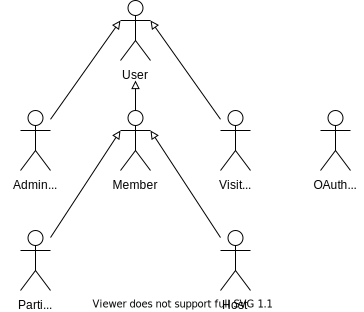
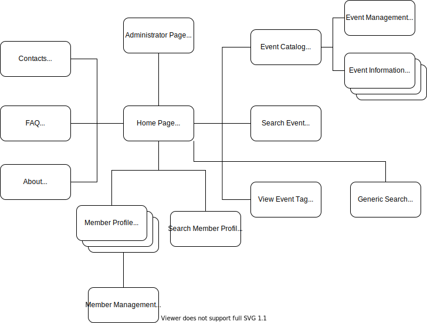
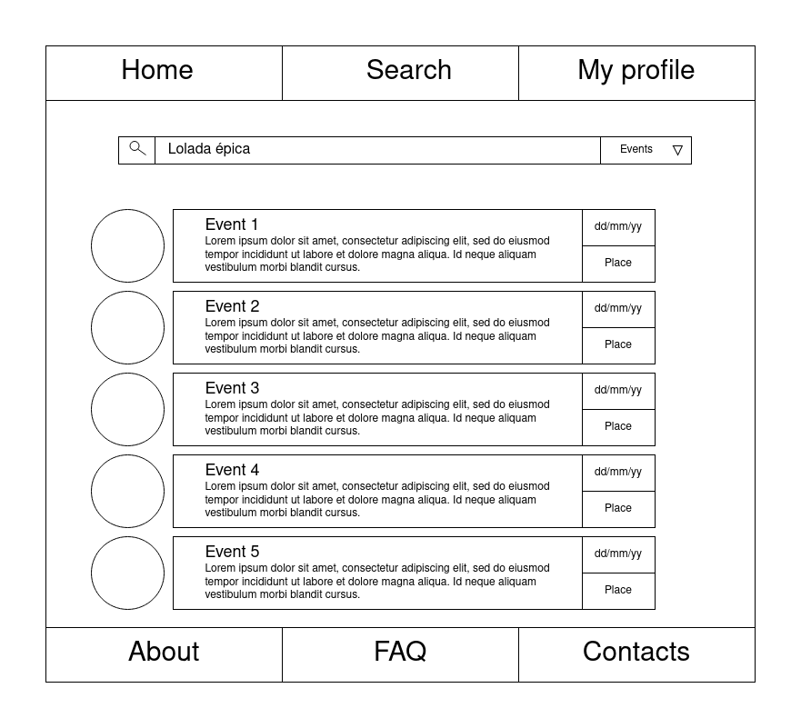
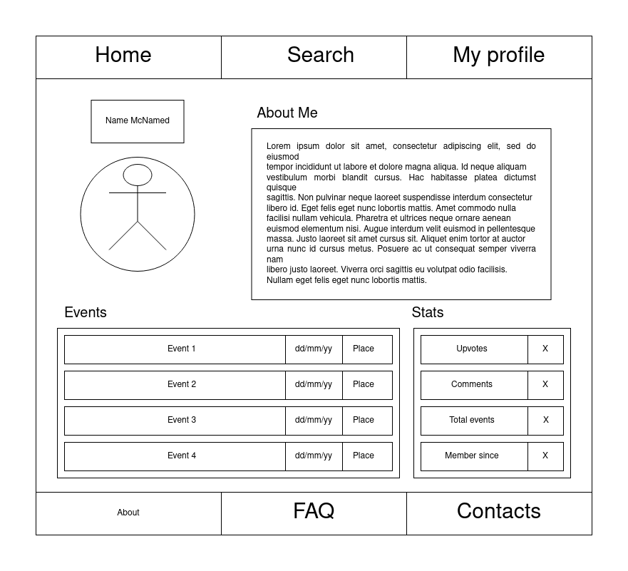

# ER: Requirements Specification Component

Providing the end-user with a **simple**, **quick** and **effective** way to host and control their events, along with allowing participants to easily find information about every aspect of the events they're enrolled in, or simply interested in possibly participating, **is our main goal**.

## A1: Event Pointer

The main goal of the Event Pointer project is the development of a web-based system to allow our users better control the events they are involved in.
 
We're mainly developing this app with college students in mind, but it can be used by anyone hosting or participating in an event.

Our intention is to give them the means to fit events into with their own busy schedules in a simple manner.

The app will hold data related to the events in the platform, their type or tag, the place they will be held at, dates, durations, among others, varying with the type of event.

### Users

Our application will have 3 different types of users:

**Visitors** can search and view events, create an account in the system using an email and password (or an external OAuth API) and sign in using an email and password (or external OAuth API), gaining access to privileged information in the process.

**Members** can search and view events, but can also create public or private events, and invite other members to their private events.
They can freely request to join public events created by other members.
Members can also manage their sent invitations and the ones they have received, having the option to deny the invitation or accept it, joining the private event that invitation refers to.
Members can manage events they are the hosts of (delete them, create event announcements, change their date, place, description and maximum number of participants).
Other actions the members can take are seeing and editing their profile page, commenting on the event discussion and voting on event announcements and discussion comments, edit or delete their previously made comments, access data about the events they're enrolled in (their date, place, description and participating members) and report events for breaking the ToS or rules.

**Administrators** can search and view events, manage user accounts (edit their email, username and profile pic url, or even delete the user account), manage participating users (remove them from the list of participants) and comments in the discussion (delete them) on events, review event reports and delete events.

### Events and Hosting

***Events*** have at least one Host, and may exist without participants.
A Member who is a host does not have to participate in it, but for the event to start, it must have at least a minimum number of participants (specified by the host).
Hosts can remove members from the participant list, and manage comments on the event's discussion.

### Searching

Administrators, Members and Visitors can search for events by type or tag, name, place, dates or duration.

Events can be filtered by full or empty events, and be sorted by date or duration.

## A2: Actors and User stories

This artifact contains the specification of the actors and their user stories, serving as agile documentation of the project’s requirements.

### 2.1 Actors

For the **Event Pointer** project, the actors can be represented as shown in the following picture **(Figure 1)** and are described in **Table 1**. 

 <small><b> Figure 1: Event Pointer actors diagram.</b></small>

 

| Identifier | Description |
| --- | ----------- |
| **User** | Generic user that has access to public event information.|
| **Visitor** | Non-authenticated users who have no privileges whatsoever, but can browse through public events, and see their details. Can become a member after signing in or registering itself in the system. |
| **Member** | Authenticated user able to create events or participate in existing events. Each member has their own user page.  |
| **Host** | Registered Member who is hosting an event. |
| **Participant** | Registered Member who attends an event. Participants are allowed to make, edit and delete discussion comments they made on an event's discussion.|
| **Administrator** |Overlook the app and its events, making sure it works as intended at all times, and modify the data of events.|
| **OAuth API**  | 	External OAuth API that can be used to register/authenticate eg. Google's authentication service, Steam's authentication service, Origin's authentication service or Battle.net's authentication service.  |

<small><b> Table 1: Event Pointer actors description and identification.</b></small>
 

### 2.2 User Stories

For the **Event Pointer** project the user stories for each user are described below:

#### User
| Identifier | Name | Priority | Description |
| ---------- | ---- | -------- | ----------- |
| **USU01**|  **Browse Public Events** | High | As a _User_, I want to browse currently available public events, so that I can find the one I am looking for. |
| **USU02** | **View Public Event** | High | As a _User_, I want to view a specific public event's details, so that I can evaluate if I found the right event for me. |
| **USU03** |  **Explore Events by Tag** | High | As a _User_, I want to search events by tag, so that I can find events about a specific topic I'm interested in. |
| **USU04** |  **Search Events** | High | As a _User_, I want to be able to search for an event using a few keywords, so that I can quickly find items I'm interested in. |
| **USU05** |  **See Home** | High | As a _User_, I want to access the home page, so that I can see a brief presentation of the website as well as how it is organized. |
| **USU06** |  **See About** | High | As a _User_, I want to access the about page, so that I can find information about the developers and a description of the website. |
| **USU07** |  **See FAQ** | High | As a _User_, I want to access the FAQ page, so that I can get answers to **F**requently **A**sked **Q**uestions. |
| **USU08** |  **See Contacts** | High | As a _User_, I want to access the contacts page, so that I can find a way to communicate with the creators of the service. |
| **USU09** |  **Search Members** | Medium | As a _User_, I want to search for Members, so that I can find a specific individual. |
| **USU10** |  **Generic Search** | Medium | As a _User_, I want to search for any Members or Events using a few keywords. |

<small><b> Table 2: Event Pointer User's user story identification, priority and description.</b></small>

#### Visitor
| Identifier | Name | Priority | Description |
| ---------- | ---- | -------- | ----------- |
|      **USV01**      | **Sign-up** | High | As a _Visitor_, I want to use an email and password to create an account and log in into the system for the first time, so that I can become a registered member and have login credentials to sign in next time. |
|      **USV02**      | **Sign-in** | High | As a _Visitor_, I want to use an email and password to log in to the system, so that I can access my registered member data and access privileged information. |
|      **USV03**      | **OAuth Sign-up** | Medium | As a _Visitor_, I want to use an external OAuth API e.g. Google OAuth API, Steam API...  to create an account and log in into the system for the first time, so that I can become a registered member and have login credentials to sign in next time. |
|      **USV04**      | **OAuth Sign-in** | Medium | As a _Visitor_, I want to use an external OAuth API e.g. Google OAuth API, Steam API...  to log in to the system, so that I can access my registered member data and access privileged information. |

<small><b> Table 3: Event Pointer Visitor's user story identification, priority and description.</b></small>

#### Member
| Identifier | Name | Priority | Description |
| ---------- | ---- | -------- | ----------- |
|      **USM01**      | **Log-out** | High | As a _Member_, I want to log out of my account, in order to become a visitor and lose all my privileges. 
|      **USM02**      | **Delete Account** | High | As a _Member_, I want to delete my account, irreparably removing it, and all data it contains, from the system.
|     **USM03**       | **Create Public/Private Events** | High | As a _Member_, I want to be able to create either public or private events, so that in a public event anyone can join invited or not but in private events only invited people can.
|      **USM04**      | **Invite Users to Public Event** | High | As a _Member_, I want to invite other members to public events, in order to increase their number of participants.
|      **USM05**      | **Manage My Events** | High | As a _Member_, I want to be able to manage my events, so that I can check the ones I have created and how many members they currently have, as well as have access to their details.
|      **USM06**      | **Manage Events Attended / to Attend** | High | As a _Member_, I want to be able to manage the events I already attended/am attending, so that I can check their dates and how many members they have, as well as have access to their details.
|      **USM07**      | **Request to Join Event**  | High | As a _Member_, I want to be able to request to join a public event, in order to participate in it. |
|      **USM08**      | **Manage Invitations Sent and Received**  | High | As a _Member_, I want to be able to manage invitations I have sent to, and received from, other Members, so I can delete them, or accept/refuse them.
|      **USM09**      | **Report Event** | Medium | As a _Member_, I want to be able to report other events, in the hope that some of them may be canceled due to breaking the ToS of the website.
|      **USM10**      | **See Profile** | Medium | As a _Member_, I want to be able to see my profile page, to see the page other users will see when they navigate to my profile.
|      **USM11**      | **Edit Profile** | Medium | As a _Member_, I want to be able to edit my profile page, so that I can change my password, username, email, and profile picture. |
|      **USM12**      | **Request to Join Special OAuth Event**  | Low | As a _Member_, I want to be able to request to join a public event that requires special OAuth authentication, in order to participate in it. E.g. If I want to join a gaming event I would need to log in in said event account to validate my entry and get results. |

<small><b> Table 4: Event Pointer Member's user story identification, priority and description.</b></small>

#### Host
| Identifier | Name | Priority | Description |
| ---------- | ---- | -------- | ----------- |
| **USH01** |  **Edit Event Details** | High | As a _Host_, I want to edit event details, so that participants and/or interested users/visitors are informed of possible updates. |
| **USH02** |  **Add User to Event** | High | As a _Host_, I want to add a specific user to an event, so that said user can attend the event. |
| **USH03** |  **Manage Event Participants** | High | As a _Host_, I want to manage event participants, so that I can add/remove people when I need to. |
| **USH04** |  **Create Polls** | High | As a _Host_, I want to be able to create polls, so that I can quickly have answers, of all participants, of a question/opinion. |
| **USH05** |  **Cancel Event** | High | As a _Host_, I want to be able to cancel events, so that I can inform participants and/or interested users/visitors when an event needs to be canceled. |
| **USH06** |  **Manage Event Visibility** | High | As a _Host_, I want to manage event visibility, so that I can control who can see its details. |
| **USH07** | **Send Event Invitations** | High | As a _Host_, I want to send event invitations, so that in a private event I can invite specific users. |
| **USH08** | **Post Event Announcements** | High | As a _Host_, I want to send event announcements, so that I can inform participants about anything on said event.  |

<small><b> Table 5: Event Pointer Host's user story identification, priority and description.</b></small>

#### Participant
| Identifier | Name | Priority | Description |
| ---------- | ---- | -------- | ----------- |
| **USP01** |  **View Event Announcements** | High | As a _Participant_, I want to view event announcements details, so that I can see possible information (eg. doubts about the event). |
| **USP02** |  **Comment on the Event Discussion** | High | As a _Participant_, I want to add comments to the event discussion so that I can ask/answer questions about the event or contact other participants. |
| **USP03** |  **Edit/Delete Discussion Comments** | High |As a _Participant_, I want to edit or delete comments on the event discussion, so that I am able to correct or delete my own comments. |
| **USP04** |  **Answer Polls** | High | As a _Participant_, I want to answer polls, so that I can let the host have participants' information about the poll topic. |
| **USP05** |  **Upload Files** | High | As a _Participant_, I want to upload files, so that I can easily express myself in a comment on an event's discussion. |
| **USP06** |  **Vote in Discussion Comments** | High | As a _Participant_, I want to vote in comments on the event's discussion, so that I can let the author know I like that message or as a way of answering a yes or no question. |
| **USP07** |  **View Attendees List** | High | As a _Participant_, I want to view the attendees' list, so that I can know who else is attending the event. |
| **USP08** |  **Leave Event** | High | As a _Participant_, I want to leave an event, so that I can leave an event I do not want to go to anymore. |

<small><b> Table 6: Event Pointer Participant's user story identification, priority and description.</b></small>

#### Administrator
| Identifier | Name | Priority | Description |
| ---------- | ---- | -------- | ----------- |
|      **USA01**      | **Search Events** | High | As an _Administrator_, I want to be able to search for an event (public or private) using keywords related to it, so that I can quickly find items that I am looking for.|
|      **USA02**      | **View Event Details** | High | As an _Administrator_, I want to view the information of a specific event, so that I am enlightened of its details.|
|      **USA03**      | **Manage Event Reports** | High | As an _Administrator_, I want to be able to manage and review event reports, so that I can either dismiss them or delete the event for breaking the ToS of the website. |
|      **USA04**      | **Delete Event** | High | As an _Administrator_, I want to be able to delete events, so that ToS breaking ones are no longer available. |
|      **USA05**      | **Delete Member Account** | High | As an _Administrator_, I want to be able to delete member accounts, so that ToS breaking ones no longer exist. |
|      **USA06**      | **Edit Member Profile** | Medium | As an _Administrator_, I want to be able to edit other Member' profiles, so that their data can be edited in order to comply with the website standards. |
|      **USA07**      | **Create Member Profile** | Medium | As an _Administrator_, I want to be able to create new Member profiles, so that new accounts can be generated for special Users/events. |

<small><b> Table 7: Event Pointer Administrator's user story identification, priority and description.</b></small>

### 2.3 Supplementary Requirements

For the **Event Pointer** project these are the supplementary requirements (Business Rules, Technical Requirements, and Extra Requirements):

#### Business Rules

| Identifier | Name | Description |
| ---------- | ---- | ----------- |
|  **BR01**  | **Event Types** | Events can be public or private. Private events are not shown in search results and are invite-only. |
|  **BR02**  | **Event Schedule** | Ending event date needs to be after starting date. Starting date also needs to be at least 1 day after event creation. |
|  **BR03**  | **Event Discussion Comments** | Participating members can edit and vote on their own comments on the event's discussion as well as delete them. |
|  **BR04**  | **Member account deletion** | Deleted accounts have all their information deleted from the database. Event discussion comments made will become anonymous and replies and votes will be locked. |

<small><b> Table 8: Event Pointer's Business Rules identification and description.</b></small>

#### Technical Requirements

| Identifier | Name | Description |
| ---------- | ---- | ----------- |
|  **TR01**  | **Security** | **All user credentials should be secured and encrypted in our system. Our databases should be tightly locked and secured from outsiders. In _Event Pointer_ we want to keep our systems safe and secure every end-user so they can trust our products.** |
|  **TR02**  | **Usability** | **The UI shall be simple to use and manage by any user. In _Event Pointer_ we want our product to be used by anyone in any age game with ease. Making our system universal and easy to use by anyone.** |
|  **TR03**  | **Privacy** | **Users can and should be allowed to keep all the information private to other users, such as emails, usernames, profile pictures, or entire profiles. In _Event Pointer_ we allow users to make all the information private to other members of the platform. This confidentiality creates trust with the members of our product.** |
|  **TR04**  | **Performance** | Our service should be fast and interactive so that every user enjoys and troubleless browsing experience. |
|  **TR05**  | **Client Software** | The most recent versions of _JavaScript_, _CSS_, _HTML_, and _PHP_ shall be used in order to ensure better security and the use of better and most recent features available. |
|  **TR06**  | **Database** | The most recent version of _PostgreSQL_ will be used to ensure the best possible security updated version. |

<small><b> Table 9: Event Pointer's Technical Requirements identification and description.</b></small>

#### Extra Requirements

| Identifier | Name | Description |
| ---------- | ---- | ----------- |
|  **ER01**  | **Deadline** | This software **must** be completed by the start of next year before the start of the second semester of the academic year so it can be used for all the events being created after that. |

<small><b> Table 10: Event Pointer's Extra Requirements identification and description.</b></small>

## A3: Information Architecture

This artifact shares the information architecture of the system to be developed, such as identification of the content, how it is organized and made available, and how it is presented to the user. In order to clarify the main ideas of this artifact it is divided into two parts:
1. A sitemap defining how pages are organized from the viewpoint of the users.
2. Content of two main individual screens (wireframes) with description and prioritization of the functionally.

### 3.1 Sitemap

The **Event Pointer** project is organized in some main areas which are: static pages that provide general information about the system (FAQ, Contacts, About), the pages used to explore events (Events' search pages and View Event Tag, Event Catalog, Information, and Management ), the member/user pages (Member Profile, Member Management and Member Search) and the pages with administration features (Administrator Page).

 <small><b> Figure 2: Sitemap diagram.</b></small>

### 3.2 Wireframes

#### UI11: Search Events

 <small><b> Figure 3: Search Events page wireframe.</b></small>

#### UI03: Member Profile

 <small><b> Figure 4: Member Profile page wireframe.</b></small>

## Revision history

Changes made to the first submission:

1. Added A1
2. Added A2 - Actors diagram
3. Added A2 - Actors table/list
4. Added A2 - User Stories
5. Added A3 - Sitemap
6. Revised A1
7. Added A3 - Wireframes
8. Small corrections

GROUP2115, 08/11/2021

* Joel Fernandes - [up201904977@edu.fe.up.pt](mailto:up201904977@edu.fe.up.pt) (editor)
* Mário Travassos - [up201905871@edu.fe.up.pt](mailto:up201905871@edu.fe.up.pt)
* Carlos Gomes - [up201906622@edu.fe.up.pt](mailto:up201906622@edu.fe.up.pt)
* Mafalda Magalhães - [up201707066@fe.up.pt](mailto:up201707066@fe.up.pt)
