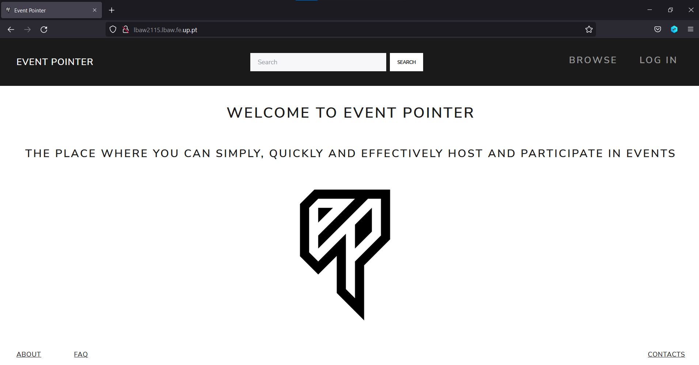
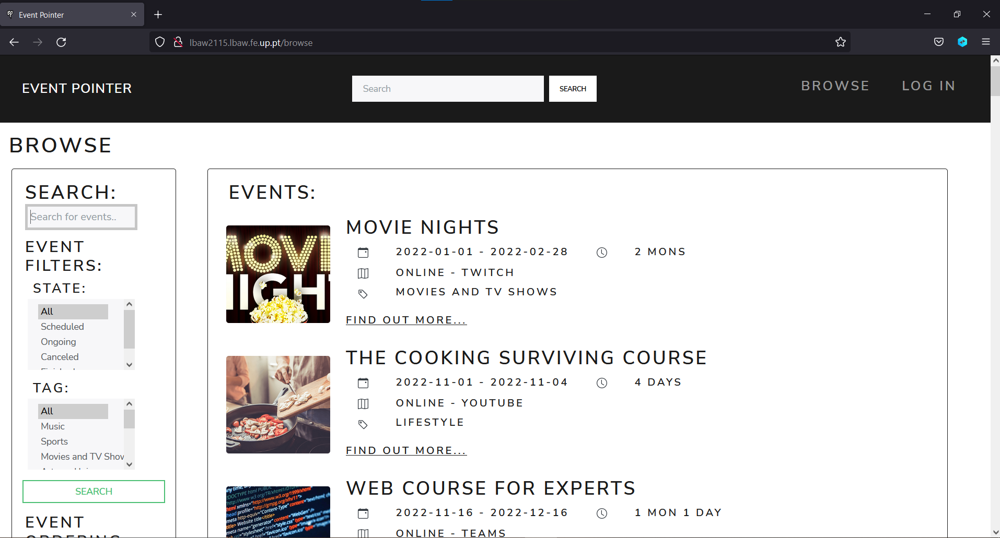
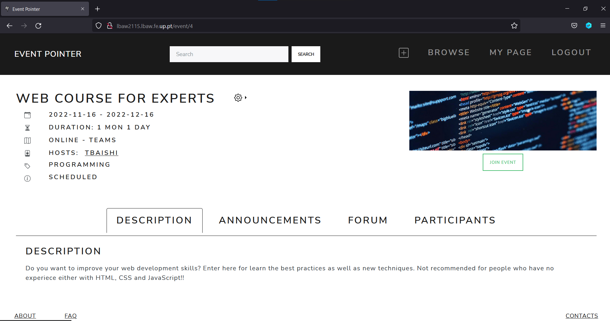

# PA: Product and Presentation

Providing the end-user with a **simple**, **quick** and **effective** way to host and control their events, along with allowing participants to easily find information about every aspect of the events they're enrolled in, or simply interested in possibly participating, **is our main goal**.

## A9: Product

The developed product provides the end-user a way to host and control created events, along with allowing to participate in events created by others. In the web app it's easy to find information about every aspect of the events enrolled in or not.

### 1. Installation

Source code can be found [here](https://git.fe.up.pt/lbaw/lbaw2122/lbaw2115/-/tree/aceb81490078af85e9578cccca2cee21e2987b38) .

To run the container use:
```
docker run -it -p 8000:80 --name=lbaw2115 -e DB_DATABASE="lbaw2115" -e DB_SCHEMA="lbaw2115" -e DB_USERNAME="lbaw2115" -e DB_PASSWORD="gAMJzXBA" git.fe.up.pt:5050/lbaw/lbaw2122/lbaw2115
```
Then access http://localhost:8000/.

### 2. Usage
The final product can be found in http://lbaw2115.lbaw.fe.up.pt/.

#### 2.1. Administration Credentials

| Email | Password |
|----------|----------|
| admin@theone.com | admintheone |
| nboulde1@netvibes.com | password |

#### 2.2. User Credentials
| Type | Email | Password |
|------|----------|----------|
| basic account | testing@testing.com | password |
| host account | hbowler5@mlb.com | password |

### 3. Application Help

When using the product some questions may arise, so consult the [FAQ page](http://lbaw2115.lbaw.fe.up.pt/faq). Here you can found the frequently asked questions which may aid you in solving your issue. Otherwise you can use the [contact page](http://lbaw2115.lbaw.fe.up.pt/contacts), in order to reach out to us for further assistance.

### 4. Input Validation

User input is validated in both client-side and server-side.

For the client-side, when creating an event, the start date needs to be bigger than today and the end date also needs to be higher than the start date. Additionally, on the client-side, we only allow the submitting of forms when all required fields are filled in.

When it comes to server-size validation, we define validators to be used whenever a post request is made to the server when, for example, a report is made or a user is authenticated.

### 5. Check Accessibility and Usability

[Accessibility](https://git.fe.up.pt/lbaw/lbaw2122/lbaw2115/-/blob/main/docs/checklist_acessibilidade_lbaw.pdf): 13/18  
[Usability](https://git.fe.up.pt/lbaw/lbaw2122/lbaw2115/-/blob/main/docs/checklist_usabilidade_lbaw.pdf):   19/28

### 6. HTML & CSS Validation

HTML:
- [Example1](https://git.fe.up.pt/lbaw/lbaw2122/lbaw2115/-/blob/main/docs/home_html_validation.pdf) 
- [Example2](https://git.fe.up.pt/lbaw/lbaw2122/lbaw2115/-/blob/main/docs/event_html_validation.pdf)  

CSS:
- [Example1](https://git.fe.up.pt/lbaw/lbaw2122/lbaw2115/-/blob/main/docs/css-app.pdf) 
- [Example2](https://git.fe.up.pt/lbaw/lbaw2122/lbaw2115/-/blob/main/docs/user-css.pdf)

### 7. Revisions to the Project

- OAuth authentication is not available anymore
- New database table for ask_access and report
- Vote in comments not allowed

### 8. Implementation Details

#### 8.1. Libraries Used

| Library name  | Description  | Usage  | Example |
|---------------|--------------|--------|---------|
| Bootstrap | It is a free and open-source CSS framework directed at responsive, mobile-first front-end web development.| Used in all pages to provide a better interface design | [Example](https://git.fe.up.pt/lbaw/lbaw2122/lbaw2115/-/blob/main/webapp/code/resources/views/pages/browse.blade.php#L64) |
| Miligram | It is a free and open-source minimalist CSS framework which provides a minimal setup of styles for a fast and clean starting point.| Used in all pages, in combination with bootstrap, in order to provide a better interface design. Especially used for UI elements. | [Example](https://git.fe.up.pt/lbaw/lbaw2122/lbaw2115/-/blob/main/webapp/code/resources/views/pages/browse.blade.php#L64) |
| Laravel | It has a variety of tools and frameworks available to you when building a web application. | Used as the main server framework for our project | [Example](https://git.fe.up.pt/lbaw/lbaw2122/lbaw2115/-/blob/main/webapp/code/resources/views/partials/normal_user.blade.php) |
| Bootswatch | It is a website with customizable and opensource bootstrap themes | Used to get the main bootstrap theme | [Example](https://git.fe.up.pt/lbaw/lbaw2122/lbaw2115/-/blob/main/webapp/code/public/css/bootstrap.min.css)|


#### 8.2 User Stories

| US Identifier | Name | Priority | Team Members | State |
|---------------|------|----------|--------------|-------|
| **USV01** | **Sign-up** | High | - | 100% |
| **USV02** | **Sign-in** | High | - | 100% |
| **USM01** | **Log-out** | High | - | 100% |
| **USU05** | **See Home** | High | Joel | 100% |
| **USU06** | **See About** | High | Mafalda, Joel | 100% |
| **USU07** | **See FAQ** | High | Mafalda, Joel | 100% |
| **USU01** | **Browse Public Events** | High | Mário | 100% |
| **USU02** | **View Public Event** | High | Joel | 100% |
| **USM05** | **Manage My Events** | High | Carlos | 100% |
| **USM06** | **Manage Events Attended / to Attend** | High | Carlos | 100% |
| **USH03** | **Manage Event Participants** | High | Carlos | 100% |
| **USU04** | **Search Events** | High | Mário | 100% |
| **USA01** | **Search Events** | High | Mário | 100% |
| **USU03** | **Explore Events by Tag** | High | Mário | 100% |
| **USM02** | **Delete Account** | High | Mafalda | 100% |
| **USA02** | **View Event Details** | High | Carlos, Mário, Joel | 100% |
| **USM11** | **Edit Profile** | Medium | Mafalda | 100% |
| **USA05** | **Delete Member Account** | High | Mafalda | 100% |
| **USA06** | **Edit Member Profile** | Medium | Mafalda | 100% |
| **USH01** | **Edit Event Details** | High | Mafalda | 100% |
| **USM03** | **Create Public/Private Events** | High | Mafalda | 100% |
| **USH05** | **Cancel Event** | High | Mafalda | 100% |
| **USM07** | **Request to Join Event**  | High | Carlos | 100% |
| **USA04** | **Delete Event** | High | Mafalda | 100% |
| **USH08** | **Post Event Announcements** | High | Carlos | 100% |
| **USP01** |  **View Event Announcements** | High | Carlos, Joel | 100% |
| **USP02** |  **Comment on the Event Discussion** | High | Carlos | 100% |
| **USP03** |  **Edit/Delete Discussion Comments** | High | Carlos | 100% |
| **USM09** | **Report Event** | Medium | Carlos | 100% |
| **USA03** | **Manage Event Reports** | High | Carlos, Joel | 100% |
| **USH02** | **Add User to Event** | High | Carlos | 100% |
| **USP08** |  **Leave Event** | High | Carlos | 100% |
| **USM04** | **Invite Users to Public Event** | High | Mário | 100% |
| **USH06** | **Manage Event Visibility** | High | Mafalda | 100% |
| **USM08** | **Manage Invitations Sent and Received**  | High | Mário | 100% |
| **USH07** | **Send Event Invitations** | High | Mário | 100% |
| **USU10** | **Generic Search** | Medium | Mário | 100% |
| **USP05** |  **Upload Files** | High | Mafalda | 20% |
| **USH04** | **Create Polls** | High | Mafalda | 40% |
| **USP04** | **Answer Polls** | High | Mafalda | 100% |
| **USV03** | **OAuth Sign-up** | Medium | - | 0% |
| **USV04** | **OAuth Sign-in** | Medium | - | 0% |
| **USP06** |  **Vote in Discussion Comments** | High | - | 0% |


## A10: Presentation

### 1. Product presentation

The project's main goal is to help its users to manage their events.

In our application, users with an account can create events or attend the ones already created. When hosting an event, the user can add or remove participants, publish announcements, edit event details as well as cancel or delete it. As a participant, users can comment on the event forum and vote on created polls. All generic users can report events or join public events (private ones are only available with an invite).

URL to the product: http://lbaw2115.lbaw.fe.up.pt

### 2. Video presentation

URL to the video: https://drive.google.com/file/d/1ydyIkb7YJVyYCsq3z6A2EjxL5zv0KDnK/view?usp=sharing







---

## Revision history

Changes made to the first submission:

1. Install
2. Usage, Application help, Check Accessibility and Usability
3. Product Presentation, Libraries Used


GROUP2115, 27/01/2021

* Mário Travassos - [up201905871@edu.fe.up.pt](mailto:up201905871@edu.fe.up.pt) (Editor)
* Joel Fernandes - [up201904977@edu.fe.up.pt](mailto:up201904977@edu.fe.up.pt)
* Carlos Gomes - [up201906622@edu.fe.up.pt](mailto:up201906622@edu.fe.up.pt)
* Mafalda Magalhães - [up201707066@fe.up.pt](mailto:up201707066@fe.up.pt)
